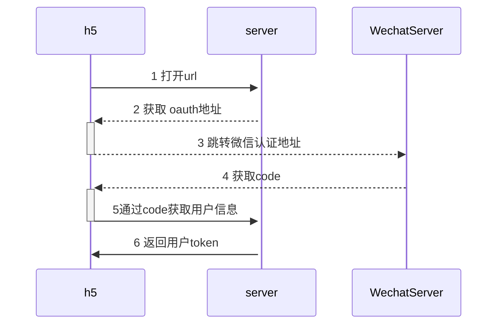

# H5-vant-typescript

## 运行项目

注意：要求 Node 版本 > v21

```shell


# 安装依赖
pnpm install

# 启动服务
pnpm dev
```

## 参考文档引导

> - [参考文档引导](https://github.com/yulimchen/vue3-h5-template)


## 改进

* 支持微信公众号认证跳转，采用 route-guard 拦截，进行优雅跳转 微信Oauth 认证



